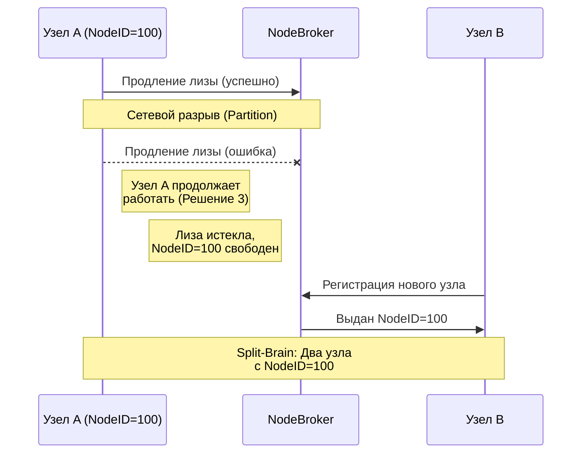
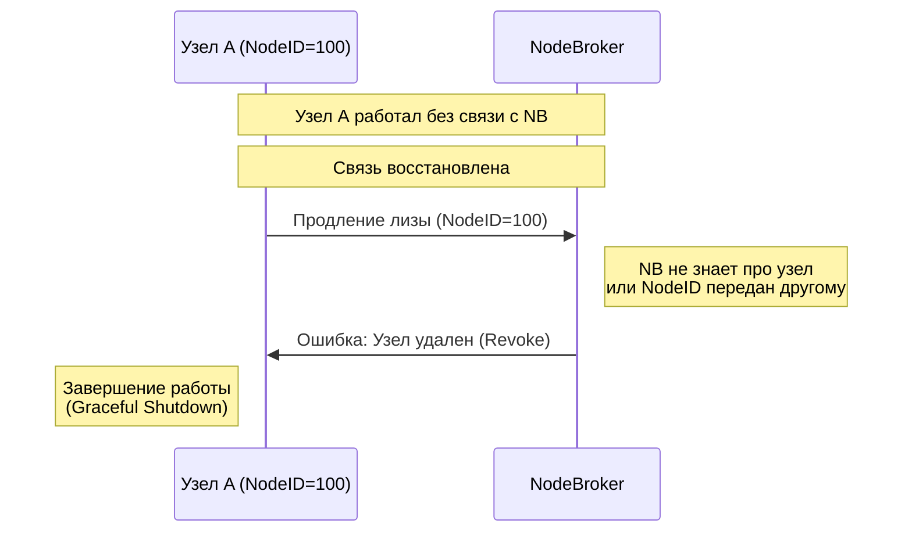
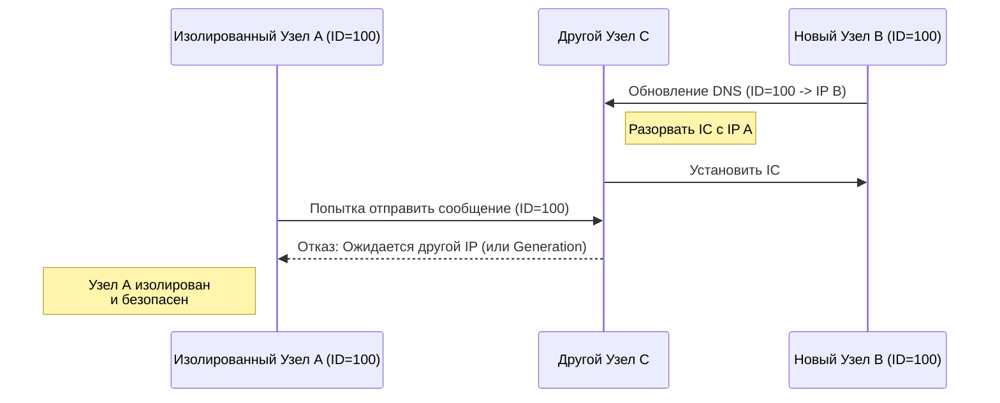

# Работоспособность кластера без NodeBroker

## Оглавление

- [Введение](#введение)
- [Текущее состояние и контекст](#текущее-состояние-и-контекст)
  - [Почему возникает проблема?](#почему-возникает-проблема)
- [Требования к совместимости](#требования-к-совместимости)
- [Потенциальные решения](#потенциальные-решения)
- [Обзор других систем](#обзор-других-систем)
  - [CockroachDB](#cockroachdb)
    - [Добавление узла](#добавление-узла)
    - [Удаление узла](#удаление-узла)
    - [При недоступности Control Plane](#при-недоступности-control-plane)

# Введение

Через час недоступности `NodeBroker` все динамические узлы в кластере завершаются и не могут больше подняться, что приводит к недоступности Data Plane. Это означает, что доступность всего кластера привязана к доступности одной таблетки.

Цель этого RFC — обеспечить работоспособность кластера **минимум 72 часа без `NodeBroker`**, включая возможность рестартов уже зарегистрированных узлов. Добавление новых узлов на время недоступности `NodeBroker` не требуется.

# Текущее состояние и контекст

Время разделено на эпохи, по умолчанию длиной в 1 час. Узлы на старте регистрируются в `NodeBroker` и получают ID, владение которым периодически продлевают в течении своей жизни. Если узел не продлил владение своим ID до конца expiration, которое привязано к концу эпохи, то узел удаляется из кластера, и через эпоху его ID может занять другой узел.

Также обеспечивается, что если узел не зарегистрирован в кластере, то нет возможности устанавливать соединение с этим узлом по IC.

## Почему возникает проблема?

1) **Самостоятельное завершение узла**: Когда узел считает, что он не смог продлить владение своим ID до конца expiration, то он завершается.
2) **Удаление узлов на стороне `NodeBroker`**: `NodeBroker` удаляет из своего состояния все узлы, которые не смогли продлить владение своим ID до конца expiration.
3) **Отказ от соединений с удаленными узлами**: Когда узел считает, что peer-узел не продлил владение своим ID до конца expiration, и при этом источник правды – `NodeBroker` – не отвечает на запрос информации об этом peer-узле, то узел не может установить с peer-узлом IC соединение.

# Требования к совместимости

`NodeBroker` и `DynamicNameserver` используются не только в YDB. На кластере могут жить базы разных версий, в том числе базы смежных проектов со своим версионированием (NBS, Solomon и тд), поэтому должна соблюдаться полная совместимость с очень старыми версиями YDB. От решения хочется получить:

- Возможность поэтапной выкатки: новые и старые узлы могут долго сосуществовать в одном кластере без деградации.
- Безопасный откат: возврат на старую версию `NodeBroker` или узлов не должен приводить к массовому завершению узлов или потере NodeID.

# Потенциальные решения

## Решение 1: Продленное время жизни узлов во время аварий

В аварийных ситуациях узлы из кластера не удаляются длительное время (72+ часа с начала аварии), достаточное для починки проблем на кластере. В штатных ситуациях узлы удаляются через час после их завершения.

Это не новый полностью новый протокол, а изменение текущего протокола:

1) Узлы продолжают продлевать лизу каждую эпоху, т.е. каждый час, сдвигая границу начала своего удаления на 72 часа вперед. При аварийном завершении узел будет удален только через 72 часа.
2) При `Graceful Shutdown` узел пингует `NodeBroker` о своем выходе из кластера, что позволяет начать удаление узла в ускоренном режиме, в конце следующей эпохи, через час.

Диапазон NodeID не будет исчерпываться, так как аварийное завершение узла, при котором узел больше не запускается – это редкость (миграция ВМ, например). Будет добавлена ручка для экстренного удаления узлов из NB для оператора.

**Плюсы:**
- Сохраняется текущий простой протокол с одним источником правды, гарантирующий уникальность NodeID
- Небольшое количество изменений

**Минусы:**
- Плохо масштабируется на другие проекты (NBS, Solomon), необходимо будет в каждом менять shutdown логику
- Если не починить проблему, узлы все равно аварийно завершатся
- При исчерпании NodeID может потребовать ручных действий

## Решение 2: Отдельный StateStorage как кэш NodeBroker

`NodeBroker` публикует свое актуальное состояние в кластерный `StateStorage` (по аналогии с `SchemeBoard` для `SchemeShard`). `DynamicNameserver` подписывается на изменения узлов в `StateStorage`.

**Плюсы:**
- Привычный подход для YDB: для `SchemeShard` есть `SchemeBoard`, для `BSController` есть `Distconf`-кэш
- Можно увеличивать надежность, размещая `StateStorage` на большом количестве узлов
- Узлы могут работать бесконечно

**Минусы:**
- В текущем протоколе работоспособность кластера требует возможность выполнять не только `read`, но и `write` операции (продление лизы), что при недоступности `NodeBroker`, приводит к двум источникам правды (`NodeBroker` и `StateStorage`) и необходимости алгоритма синхронизации между ними
- Сложности с совместимостью: откат `NodeBroker` на версию без `StateStorage` оставит в кластере узлы, которые читают из устаревшего `StateStorage`.
- `StateStorage` хранит данные в памяти, в инцидентах его страшно рестартовать
- `StateStorage` общекластерный, и весь кластер может страдать от одного пользователя

## Решение 3: Завершение узла только по сигналу от NodeBroker

Текущее правило "узел завершается, если не смог продлить expiration" заменяется на "узел завершается только когда явно узнал от `NodeBroker`, что он был удален". Пока `NodeBroker` недоступен, узел просто продолжает работать со своим NodeID.

Чтобы забытые узлы не нарушали работу кластера, остальные узлы отказывают в IC-коннекте узлам, про которые в их кэше явно записано "удален".

**Плюсы:**
- Узлы могут работать бесконечно
- Небольшое количество изменений

**Минусы:**
- Усложнится отладка из-за возможности split-brain
- В кластере могут быть узлы с одинаковым NodeID, теряется уникальность NodeID

### Анализ Решения 3: Риски Split-Brain и сценарии восстановления

При использовании Решения 3 возникает ключевая проблема: **Split-Brain по NodeID**, когда один и тот же `NodeID` может быть назначен двум разным физическим узлам.

#### Как возникает Split-Brain

1. **Недоступность NodeBroker**: Связь между Узлом А и `NodeBroker` прерывается (сетевой раздел или падение NB).
2. **Истечение лизы**: `NodeBroker` фиксирует, что Узел А не продлил лизу, считает Узел А мертвым и освобождает его `NodeID`.
3. **Регистрация нового узла**: Новый Узел Б подключается к кластеру и запрашивает у `NodeBroker` идентификатор. `NodeBroker` выдает ему освободившийся `NodeID` Узла А.
4. **Split-Brain**: В кластере работают два разных узла (Узел А и Узел Б) с одинаковым `NodeID`.

#### Риски Split-Brain (Два узла с одинаковым NodeID)

- **Конфликты Interconnect (IC)**: Если другой узел кластера хочет отправить сообщение узлу с `NodeID=100`, он может установить соединение с любым из двух узлов. Сообщения могут маршрутизироваться случайным образом.
- **Ошибки ActorSystem**: Сообщения, адресованные конкретным акторам на `NodeID=100`, будут приходить на случайный из двух узлов. Если актора на другом узле нет, сообщение будет отброшено (`Undelivered`).
- **Нарушение консистентности (Data Corruption)**: Если оба узла начнут взаимодействовать с распределенным хранилищем от имени одного `NodeID`, это может сломать логику лидерства или блокировок.
- **Сбои в кэшах соединений (DynamicNameserver)**: Таблицы маршрутизации на других узлах будут постоянно "флапать" между IP-адресами узлов А и Б при обновлении информации о топологии.

#### Восстановление после недоступности NodeBroker

Когда `NodeBroker` становится доступным после аварии:

1. Старые узлы, пережившие аварию, пытаются возобновить продление лизы.
2. `NodeBroker` видит запрос от узла, которого нет в его активном реестре (или чей `NodeID` уже передан другому узлу).
3. `NodeBroker` возвращает узлу явную команду **"Удален"** (Revoke/Evict).
4. Узел, получив команду, **завершает работу** (Graceful Shutdown).

#### Сценарии минимизации Split-Brain

Чтобы Решение 3 было жизнеспособным, необходимо реализовать механизмы защиты:

1. **Использование Generation (Эпохи запуска) в Interconnect**:
   Вместе с `NodeID` `NodeBroker` должен выдавать уникальный монотонно возрастающий `Generation` (например, timestamp). Interconnect соединения должны устанавливаться по паре `(NodeID, Generation)`. Узел откажется принимать соединения с меньшим `Generation`, изолируя старый узел.

2. **Защита через StateStorage (DynamicNameserver)**:
   Когда новый Узел Б перехватывает `NodeID`, он перезаписывает адрес в `StateStorage`. Остальные узлы получают обновление и разрывают старые IC сессии с Узлом А. Узел А оказывается в изоляции.

3. **Карантин NodeID (Tombstone)**:
   Вместо моментального освобождения просроченного узла, `NodeBroker` держит `NodeID` в состоянии `Tombstone` на протяжении длительного времени (например, 72 часа). Это гарантирует, что `NodeID` не будет переиспользован во время аварии, устраняя корневую причину Split-Brain (сводит Решение 3 к гибриду с Решением 1).

## Решение 4: Не переиспользовать NodeID

Не подходит, так как NodeID входит в ActorID, который ограничивает максимальное NodeID до 1 миллиона.

Можно рассмотреть только

# Обзор других систем

## CockroachDB

В CockroachDB нет разделения на compute и storage узлы.

### Добавление узла

Для добавления узла надо запустить процесс `cockroach` с указанием адреса уже работающих в кластере узлов (`--join`).
- Если узел не проиницализирован, то он посылает `Join` запрос в кластер, в процессе которого ему выделяется новый NodeID в системном шарде. Полученный NodeID персистентно сохраняется на диске узла, и узел считается проициниализированным.
- Если узел проинициализирован, то он читает свой NodeID с диска под ногами и запускается вместе с ним.

### Удаление узла

Узлы шлют `hearbeat`-ы в специальный системный шард каждые 5 секунд. Изменения в этом системном шарде распостраняется по всем узлам с помощью gossip. Если в течении 5 минут от узла не поступало `heartbeat`-ов, то остальные узлы будут считать его `DEAD`. Другие узлы могут продолжать пытаться связаться с `DEAD` узлом. `DEAD` узел может снова подключиться к кластеру.

Узел удаляется явной командой оператора `decomission`. После чего узел переходит в статус `DECOMISSIONED`, в котором он не может взаимодействовать с остальным кластером, и попытки подключения клиентов приводят к ошибке. Удаление узла не приводит к освобождению его NodeID, но информация о таких узлах не распостраняется в gossip.

### При недоступности Control Plane

- **Новые узлы**: не могут войти в кластер
- **Перезапущенные узлы**: могут войти в кластер (используют сохранённый NodeID)
- **Существующие узлы**: продолжают работу, но считают остальные узлы как `DEAD` из-за отсутствия `heartbeat`-ов
